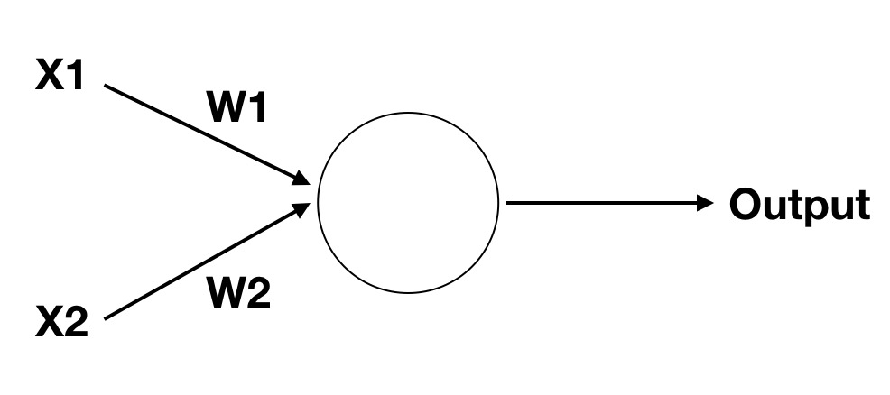
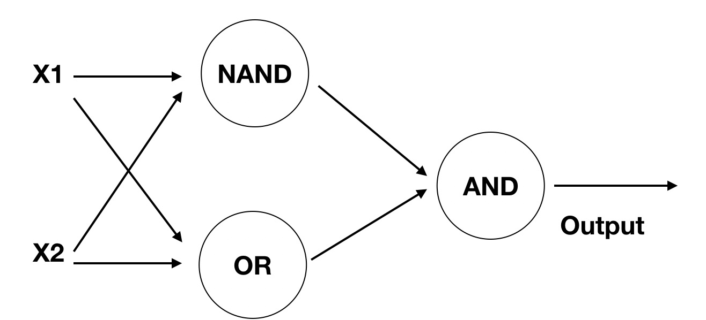

# 实现异或操作


## 数字逻辑

先来回顾一下数字逻辑，它包含 与（AND）, 或（OR）,非（NOT）, 与非（NAND），异或（XOR）几种。

- 与（AND） 两真才真
- 或（OR） 一个为真就为真
- 非（NOT）取相反
- 与非（NAND）两假为真
- 异或（XOR）两个不同就为真

对应图像化展示就是


从这个图我们可以很清晰的发现，前三者可以很容易的用线性划分开，但是异或却不可以。而感知机恰恰只能实现线性分类。所以它不能完成异或操作。

还记得我们在最开始介绍深度学习时提及感知机说他因为某种缺陷被淘汰，这个缺陷就是他甚至不能实现异或操作。而这也导致了第一次人工神经网络危机，具体的解决需要等后来多层感知机及BP算法的提出。

现在还请稍安勿躁，我们在下文将实现这个问题。


## 实现与

我们将上节的感知机模型再拿过来，


但是我们只需要两个输入，另外想一想公式，简单来说就是
$$out = (X1W1 + X2W2 + b >=0)$$
如果需要实现与操作，将W1=X2=1，b=-1.5，对应的情况

- X1=0, X2=0, out = (0 * 1 + 0 * 1 - 1.5 >=0) = 0
- X1=1, X2=0, out = (1 * 1 + 0 * 1 - 1.5 >=0) = 0
- X1=0, X2=1, out = (0 * 1 + 1 * 1 - 1.5 >=0) = 0
- X1=1, X2=1, out = (1 * 1 + 1 * 1 - 1.5 >=0) = 1

用代码实现的话就是下面这样
```python
def AND(x1, x2):
    return 1 if x1*1 + x2*1 - 1.5 >= 0 else 0
```

## 实现或

如果需要实现与操作，将W1=X2=1，b=-0.5，对应的情况

- X1=0, X2=0, out = (0 * 1 + 0 * 1 - 0.5 >=0) = 0
- X1=1, X2=0, out = (1 * 1 + 0 * 1 - 0.5 >=0) = 1
- X1=0, X2=1, out = (0 * 1 + 1 * 1 - 0.5 >=0) = 1
- X1=1, X2=1, out = (1 * 1 + 1 * 1 - 0.5 >=0) = 1

用代码实现的话就是下面这样
```python
def OR(x1, x2):
    return 1 if x1*1 + x2*1 - 0.5 >= 0 else 0
```

## 实现与非

如果需要实现与操作，将W1=X2=-0.5，b=0.7，对应的情况

- X1=0, X2=0, out = (0 * -0.5 + 0 * -0.5 + 0.7 >=0) = 1
- X1=1, X2=0, out = (1 * -0.5 + 0 * -0.5 + 0.7 >=0) = 1
- X1=0, X2=1, out = (0 * -0.5 + 1 * -0.5 + 0.7 >=0) = 1
- X1=1, X2=1, out = (1 * -0.5 + 1 * -0.5 + 0.7 >=0) = 0

用代码实现的话就是下面这样
```python
def NAND(x1, x2):
    return 1 if x1*-0.5 + x2*-0.5 + 0.7 >= 0 else 0
```
## 实现异或

异或的真值表如下

X1 | X2  | out 
      ---|-----|---
0     | 0   | 0
0     | 1   | 1
1     | 0   | 1
1     | 1   | 0

各位可以自己带入单个感知器的公式证明一下为什么无论权重w和偏置b设置为什么都无法实现异或操作。

但接下来我们将引入多层感知器，在多层感知机的第二层，分别实现一个与非门和或门，然后再将第二层的输出送入与门，可能有点绕了
直接看下面对应的真值表

X1 | X2| S1 | S2  | out 
 ---|---|---|---|---
0  |0    | 1 |    0 | 0
0  |1    | 1  |   1 | 1
1  |0   | 1   |  1 | 1
1  |1   | 0  |   1 | 0

那接下来就是设计这样的结构了



最后我们用代码实现看看吧
```python
def NOR(x1, x2):
    s1 = NAND(x1, x2)
    s2 = OR(x1, x2)
    return AND(s1, s2)
```

讲了这么多例子有什么用呢？其实目的只是回答上节的问题，用多层多个感知器可以实现更加复杂的内容。这在接下来的学习中会经常表现出来。