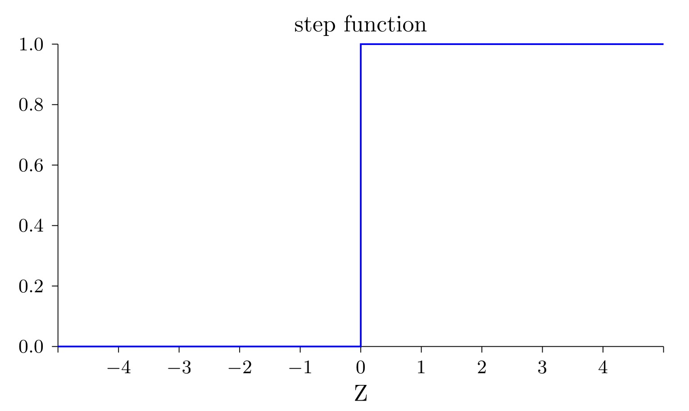
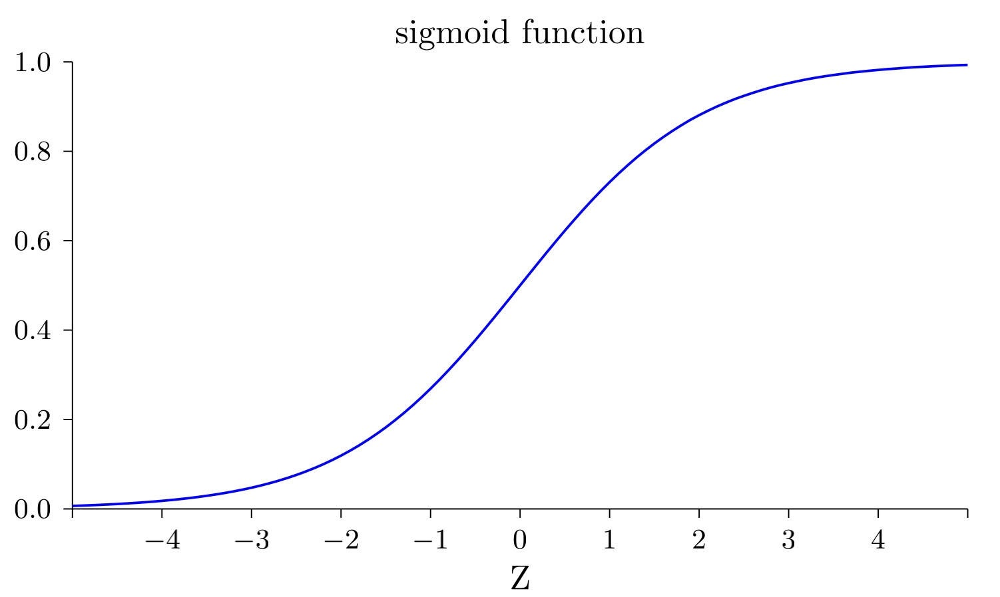
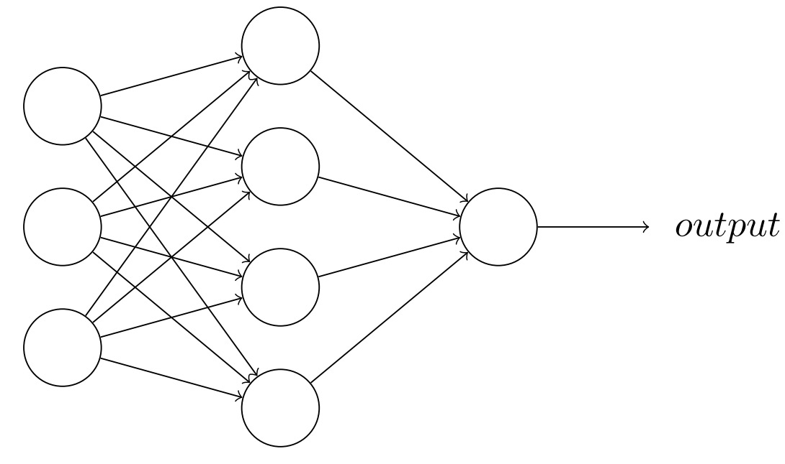
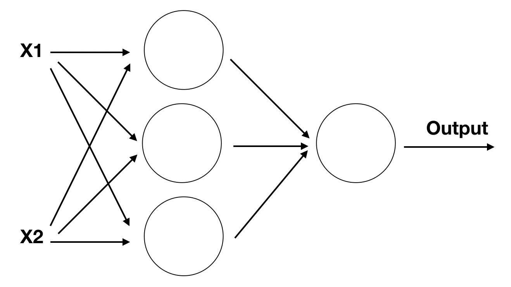

# S型神经元

在我们之前的讲解中，你已经知道了感知器可以实现二值分类，也就是通过输入判断输出0还是1。但这种感知器的功能还是太有限了，因此我们希望能够丰富一下它的功能。

## 激活函数
当我们利用感知器实现二值分类的时候，我们实际上是通过一个<def>阶跃函数</def>对输入加权 \(x * w + b\) 进行判断，并得到最终的输出。这个阶跃函数可能长这样



$$output = \left\{\begin{matrix}
 & 0 &  if & x < 0 \\ 
 & 1 & if & x > 0
\end{matrix}\right.$$


现在我们给对输入进行处理的这类函数取个名字，叫<def>激活函数</def>。比如刚刚提到的阶跃函数就属于激活函数。既然起了中文名字，那肯定要对应来一个数学符号表达，就用\( \delta \)吧。

那现在第一节中感知器的表示就不再需要判断分支了，可以直接写成

$$output = \delta(x * w + b)$$

这里加权输入这么长也不好看，我们直接用

$$ z \equiv x * w + b $$ 简写一下，上式就可以变成

$$output = \delta(z)$$

现在看是不是清爽多了。


## sigmoid函数


正如世界并不是非黑即白，而是有无穷个中间色一样，如果我们感知器的输出只能输出两个值，那他的表示能力肯定是有限的，因此我们希望能将<def>阶跃函数</def>修改为<def>sigmoid函数</def>，这样可以对不同的输入返回0到1之间任意的值，比如0.3713，用来表示神经元的激活状态。我们的sigmid函数长成这样



这样我们就对感知器引入了<def>平滑特性</def>。他可以对于输入和权重带来的微小改变产生输出的微小变化。现在我们用数学公式表示一下这个sigmoid函数
$$sigmoid(z)\equiv \frac{1}{1+e^{-z}}$$
其中z表示 \(x * w + b\)，这样上式就可以表示为
$$out = \delta(z) = sigmoid(z) = \frac{1}{1+exp(x * w + b\}}$$
而这，就是<def>S型神经元</def>的表达式了。另外我们之后在描述时候就不再使用感知器了，而是使用<def>神经元</def>来表示这样一个对输入作出反映的单元。

!!! Important

	需要注意的是，S型神经元的激活函数并非只有simgoid函数一种，他还可以包含类似tanh等激活函数，这些不同的函数具体作用和应用场景又有不同，但此时暂时不过多介绍。


## 自我学习

经过替换激活函数，我们有了一个可以表示非线性拟合的神经元了。接下来我们回想一下上节让神经元实现逻辑门时候的代码。每个神经元的权重和偏置都是我们人为设定的。但是，权重和偏置可是神经元独一无二的特性啊，如果都手工设定，怎么能展示他们的个性呢？
有没有一种方法，可以让神经元根据任务的不同，自己去学习自己独属的权重和偏置呢？

答案当然是可以的，但正如我们之前所说，一个神经元的力量太微小了，他不能完成某些任务。所以当我们希望神经元自己根据不同任务学习权重和偏置时，我们一般需要先搭建一个神经网络，他可能长下面这样子



他和我们之前的多层感知机是不是相同，但这里每个小组件都替换成了神经元，因此整体也被我们称为<def>神经网络</def>。

想象一下我们正在玩1-100的猜数字游戏，A先想出一个数字，B去猜，如果大了就继续猜更小的数字，如果小了就继续猜更大的数字，直到最后猜出那个正确的数字。

我们梳理一下这个过程，首先它是一个反馈过程。需要知道猜测的结果是大还是小，还要知道根据这个结果怎么去修改猜测的值。对应到神经元的学习中，就是我们需要一个<def>损失函数</def>去判断神经元输出的结果和目标结果差距有多少。
还需要一个<def>反向传播算法</def>来告诉神经元该怎么修改。通过多次尝试学习，网络就会根据目标自己让每一个神经元学习各自权重和偏置，进而使整个网络实现我们设定的目标。

上面突然就提到了两个新概念，而且都是复杂而又困难的。我们现在先简单引入一下损失函数，至于<def>反向回传算法</def>将在下一节仔细讲解。目前你只需要只要我们会用到他就好了。

## 损失函数
损失函数可以网络学习中一个非常重要的概念，用于衡量模型的预测值与真实值之间的差异，即模型的误差大小。损失函数的作用是指导模型的训练过程，帮助模型不断地优化，最终得到更准确的预测结果。

他就像一个神经网络的领路人，但这里我们先简单介绍一个最基本的<def>L1 loss</def>。他用来表示当前网络的输出y与目标(ground truth,gt)之间的距离，表示为
$$L1 \ \ loss(y, gt) = (y-gt)$$ 

当预测值和目标值差距远的时候，对应的损失值就大，相反如果距离近，损失值就小。

当然深度学习发展这么长时间产生了许多不同的损失函数，他们有各自不同的优势及应用场景，但他们目的都是衡量网络预测的结果和目标结果之间的差距。之后我们会尽量详细的介绍不同损失函数的作用以及区别。

目前我们只需要先了解这个L1 loss就好，我们将用他来设计一个可以自己学习的神经网络，实现异或操作。

## 设计网络实现异或操作

这里假设你已经对python有了基础的知识，首先我们需要导入基本的模块

```python
import numpy as np
import matplotlib.pyplot as plt
```
其中numpy是我们用于计算的库，plt则是后续用来观察的库

然后我们可以定义输入的数据和期望得到的结果,输入是一个二维数组，用来枚举所有可能的输入情况。输出为对输入进行异或操作期望的结果。

```python
x = np.array([[0,0,1,1],[0,1,0,1]])
y = np.array([0,1,1,0])
```
接下来我们需要定义一个神经网络，他的输入是2，因为每次x的取值是2。隐藏层定义为3，这个是任意取得，当然你也可以选择2或者4。最后设计输出层为1，因为输出只可能有一个值。
这样我们的代码就可以添加上这样的超参

```python
inputN, hiddenN, outN = 2, 3, 1
```
这时候网络如果可视化的话，它长下图这样子



我们定义一下他前向传输的过程，首先需要输入到隐藏层的权重\(w_{1}\)和偏置\(b_{1}\)，以及隐藏层到输出层的权重\(w_{2}\)和偏置\(b_{2}\)，他们用代码表示为
```python
w1 = np.random.rand(hiddenN, inputN)
b1 = np.random.rand(hiddenN,1)
w2 = np.random.rand(outN, hiddenN)
b2 = np.random.rand(outN,1)
```

回忆一下s型神经元的表达式，我们似乎缺一个激活函数\(\delta\),他用代码表示为
```python
def sigmoid(x):
    return 1.0 / (1 + np.exp(-x))
```

现在就可以写出前向传播的完整过程了

```python
def forward(x,w1,b1,w2,b2):
    # 必须将b1变成列向量
    z1 = np.dot(w1,x) + b1
    a1 = sigmoid(z1)
    z2 = np.dot(w2,a1) + b2
    a2 = sigmoid(z2)
    return z1,a1,z2,a2
```

通过前向传播我们就能得到网络的预测结果了，但是更重要的是我们需要<def>反向传播算法</def>和<def>损失函数</def>来修正神经元的值，由于我们在下一节才能讲解反向传播函数，所以此时我们先列出他的实现，并不要求深入探究具体原因。
```python
def backward(x,y,z1,a1,z2,a2,w1,w2):
    bs = x.shape[1]
    dz2 = a2 - y
    dw2 = np.dot(dz2, a1.T) / bs
    db2 = np.sum(dz2, axis=1,keepdims=True) / bs
    dz1 = np.dot(w2.T,dz2)*a1*(1-a1)
    dw1 = np.dot(dz1, x.T) / bs
    db1 = np.sum(dz1, axis=1,keepdims=True) / bs
    # 对dw1和dw2的数据的尺寸进行设置
    dw1 = dw1.reshape(w1.shape)
    db1 = db1.reshape(b1.shape)
    dw2 = dw2.reshape(w2.shape)
    db2 = db2.reshape(b2.shape)
    return dw1,db1,dw2,db2

```

损失函数定义为上面提到的l1 loss
```python
loss = np.sum(y - out)
```

接下来就是通过一定的迭代次数训练该网络，他的整个过程是

```python
import matplotlib.pyplot as plt
# 对超参数进行设置
lr = 0.01
epochs = 10000
losses = []
bs = x.shape[1]
# 进行训练
for epoch in range(epochs):
    # 进行前项传播
    z1,a1,z2,a2 = forward(x,w1,b1,w2,b2)
    loss = -np.sum(y * np.log(a2) + (1-y)*np.log(1-a2)) / bs
    losses.append(loss)
    # 进行反向传播
    dw1,db1,dw2,db2 = backward(x,y,z1,a1,z2,a2,w1,w2)
    w1 -= lr * dw1
    b1 -= lr * db1
    w2 -= lr * dw2
    b2 -= lr * db2
 
# 绘制损失函数曲线
plt.plot(losses)
plt.xlabel("epoch")
plt.ylabel("loss value")


```

如果代码正确的话，你将得到一张这样的损失函数图像

可以看到输出和gt已经很像了，到这里我们就实现了设计一个神经网络，并通过迭代学习是他达到一个功能。以后你遇到的所有内容都是对这个项目的拓展和补充修改。此时你唯独对反向传播还完全不理解，那继续进行下一节的学习吧。
