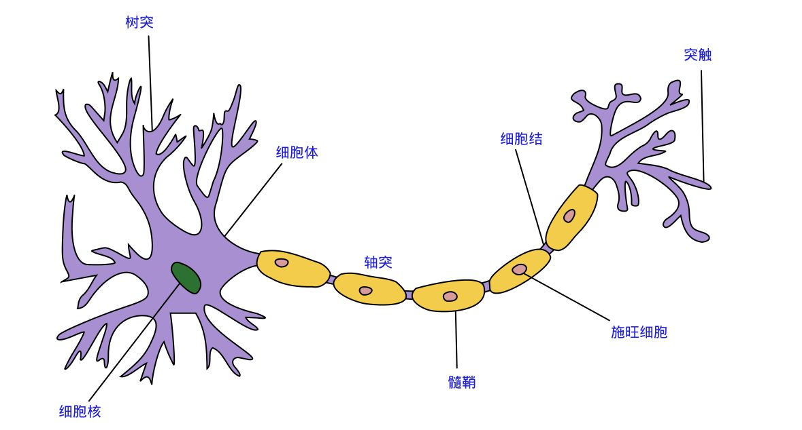

# 感知器

## 感知器和神经元
在人类视觉系统中，包含数以亿记的神经元及百亿级别的神经元连接。他们通过不同层级逐步处理更加复杂的图像。通过数亿年间的进化，我们能够轻松的利用视觉系统识别处理复杂的人，物，事。

对于计算机而言，图像的存放方式只是不同的数字组合，如何让计算机识别不同图像的内容？

科学家们通过精妙的设计，得到了计算机的神经元，也就是感知器，他可以通过输入的不同，产生对应的输出。

首先我们给感知器送入三个输入 \(X_{1}, X_{2}, X_{3}\), 当然你也可以让他有其他数量的输入。然后我们希望在处理每个输入的时候能有不同的权重，因此我们引入了权重的概念。我们将三个输入对应的权重表示为 \(W_{1}, W_{2}, W_{3}\)。此时我们就可以通过
$$\sum_{i=1}^{3}{X_{i}W_{i}}$$
来表示当前感知器获得的输入。 对应的我们需要根据这些输入知道感知器该有什么输出。因此我们需要一个阈值对输入进行判断，又由于我们只想知道当前输入是否要触发感知器作出反应，所以我们将输出表示为0或1两种值，对应的就是不触发输出和触发输出。因此这个感知器可以表示为
$$output = \left\{\begin{matrix}
 & 0 & if &\sum_{i=1}^{3}{X_{i}W_{i}} < threshold \\ 
 & 1 & if &\sum_{i=1}^{3}{X_{i}W_{i}} > threshold
\end{matrix}\right.$$

这就是感知器的完整工作。

## 举个例子
假如我们想用这个感知器帮助我们选择是否去一家餐厅。我们的判断原因可能包含1）距离2）口味 3）价格三种。我们希望在阈值超过1.5我们就去这家餐厅。

如果A餐厅距离近，价格低，但口味差，因此输入就是 （1，0，1），如果权重都为1，那么输出就是2，大于阈值1.5，所以我们会选择去这家餐厅。

如果我们对口味特别看重，将他的权重设置为2，但是对距离和价格不看重，将他们的权重设为0.5。此时得到输入是（1 * 0.5+0 * 2+1 * 0.5) = 1,小于阈值，我们就不会选择这家餐厅。

现在是不是发现这个小小的感知器确实可以帮助我们做一些判断了？

## 偏置
对于上面的公式我们并不是特别满意，因为我们的输出需要跟阈值进行对比，但我们只想知道输入和0对比会得到什么样的输出。
这不是很简单吗，只需要把阈值移到公式的左边就好了，对应的我们就引入偏置的概念。将偏置表示为b，其中
$$b=-threshold$$
这样上式就变成了
$$output = \left\{\begin{matrix}
 & 0 &  if &\sum_{i=1}^{3}{X_{i}W_{i}} + b < 0 \\ 
 & 1 & if &\sum_{i=1}^{3}{X_{i}W_{i}} + b > 0
\end{matrix}\right.$$

进一步，我们觉得连加符号也太丑了，我们干脆用向量表示好了，也就是
$$x\cdot w\equiv \sum_{i=1}^{n}{X_{i}W_{i}}$$

感知器的判断公式就进一步变成了
$$output = \left\{\begin{matrix}
 & 0 & if  &x\cdot w + b < 0 \\ 
 & 1 & if  &x\cdot w + b > 0
\end{matrix}\right.$$

这样来看，我们的感知器表达是不是就清爽多了。

## 多层感知机
现在我们想丰富一下感知器的功能，好让他能够适应一些更复杂的情况。联想到人类的神经元会通过多层传递的方式共同工作进而处理更复杂的情况。我们也可以将多个感知机组合起来形成一个多层感知机，他可能长下面这样

这里我们有5个输入，经过总共8个感知器进行处理，每一列的感知机我们称之为一层。这8个感知器正好形成了一个三层感知机，在第一层的时候，由3个感知器对输入进行判断并得到对应的输出，然后他们的输出又将送到第二层进行判断，最后第三层的感知器得到最终的输出。

注意第一层感知器好像有四个输出，但其实他们只有一个输出值，图像只是表示这样相同的输出值需要作为第二层4个神经元的输入。

俗话说人多力量大，那神经元多了必然功能也更棒了，具体通过下一节的学习就会有体现了。